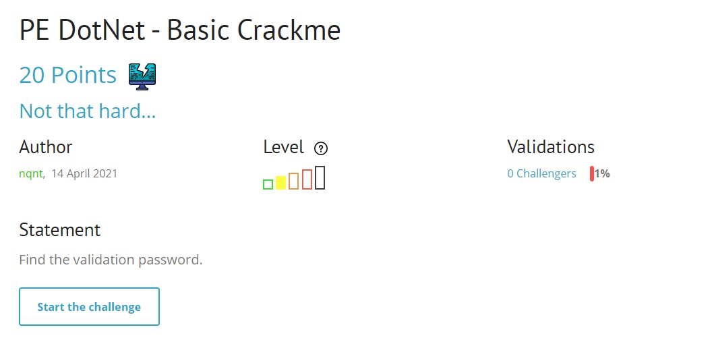
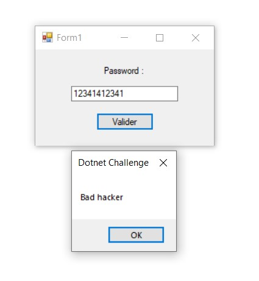
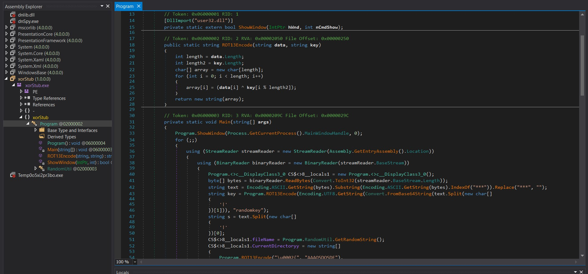
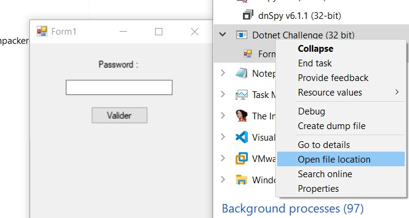
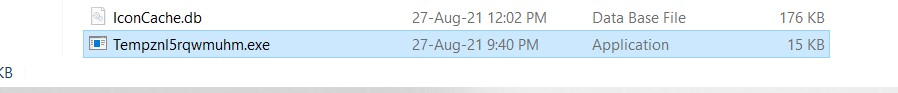
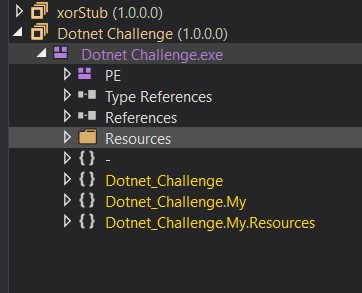
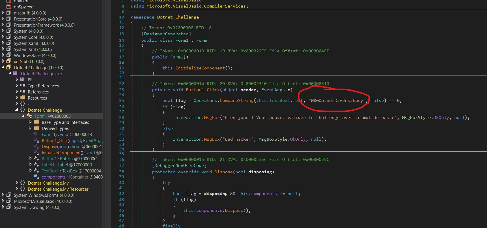
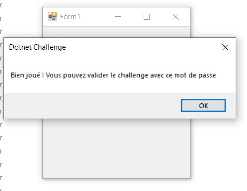

## [Writeup] Rootme - PE DotNet - Basic Crackme 
*CTK MTA*

Challenge này rootme cho ta một file PE viết bằng C#.

----

Khi mở file sẽ yêu cầu nhập mật khẩu và nhiệm vụ là cần tìm được mật khẩu chính xác
 

----
Dùng file rootme cho load trực tiếp trên dnSpy ta được
Mình đã mất một thời gian đọc code. Nhưng mọi thứ lại đơn giản như cái tên của nó vậy.
 

----
Để làm được challenge này bạn cần biết một chút về cách chương trình hoạt động.
Trong khi mở file ch46.exe, ta mở Task Manager để xem các tác vụ nó chạy những gì.
Chọn *Open file location* 
 

----
Nó sẽ dẫn ta đến một file tạm được chương trình sinh ra trong quá trình chạy.
Bỏ file này vào dnSpy ta sẽ xem được code chính của chương trình.
 

----

 

----

Mở *Form 1* ta thấy ngay đoạn password dạng phaintext đang được compare
Vậy là xong rồi ^^, Submit thôi !!!

 

----

 

----

Cảm ơn bạn đã quan tâm.

